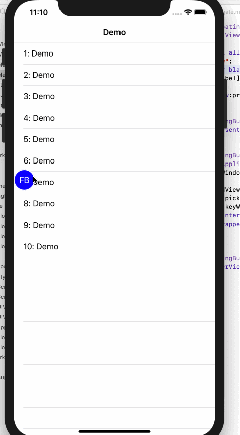

# FloatingButton

1. 全局悬浮可拖动按钮
2. wrapper

# Demo工程演示

1. `https://github.com/DanboDuan/FloatingButton.git`
2. `pod install`
3. `open Demo.xcworkspace`

**效果如图**



# 使用

1. 直接copy代码，并用你的项目前缀重命名文件、类和协议。
2. pod

```Ruby
pod 'FloatingButton',:git => 'https://github.com/DanboDuan/FloatingButton.git',:branch => 'master'
```

# 协议

使用 MIT 协议，详情见[LICENSE](LICENSE)文件。